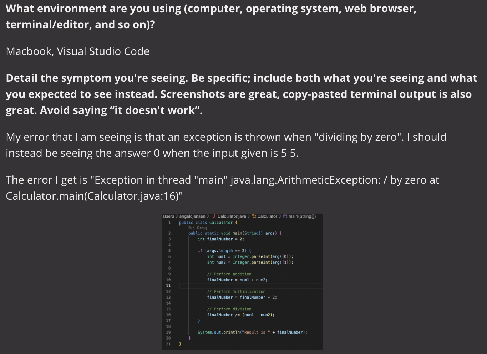
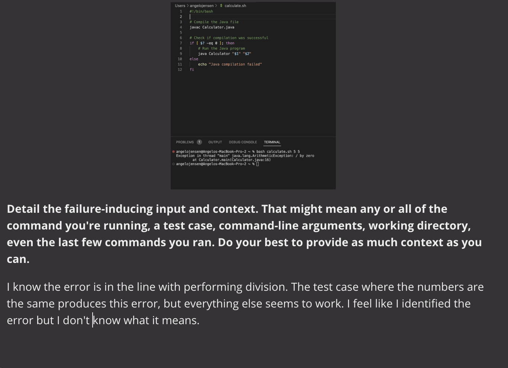
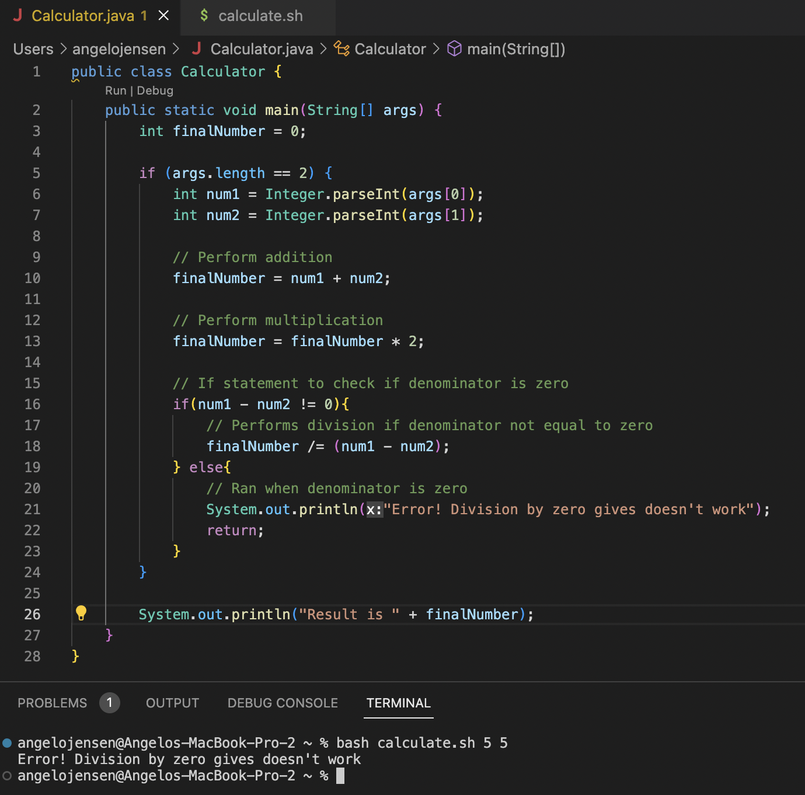
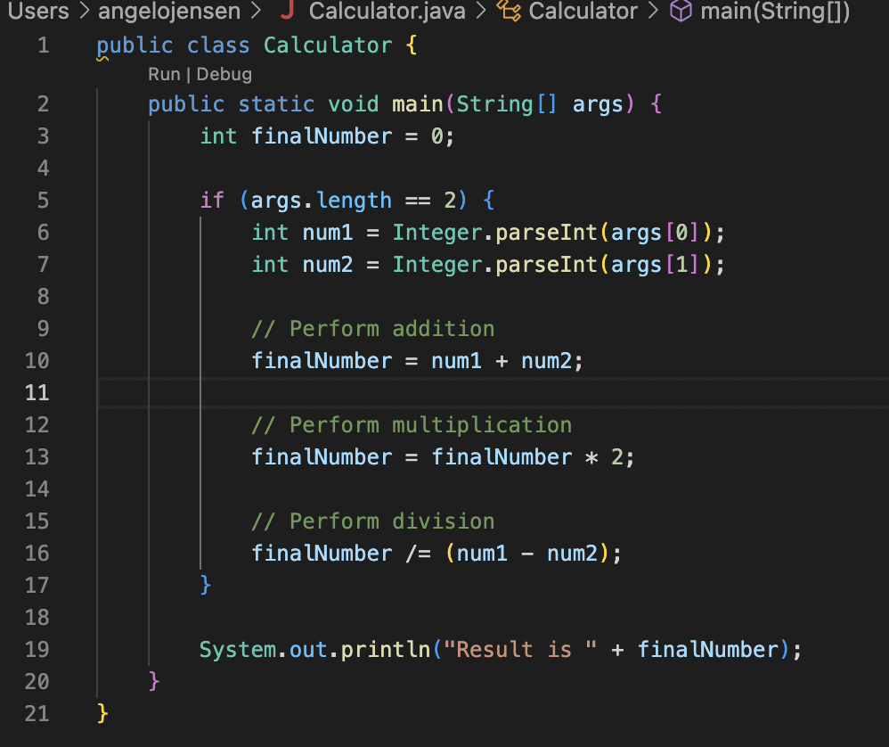
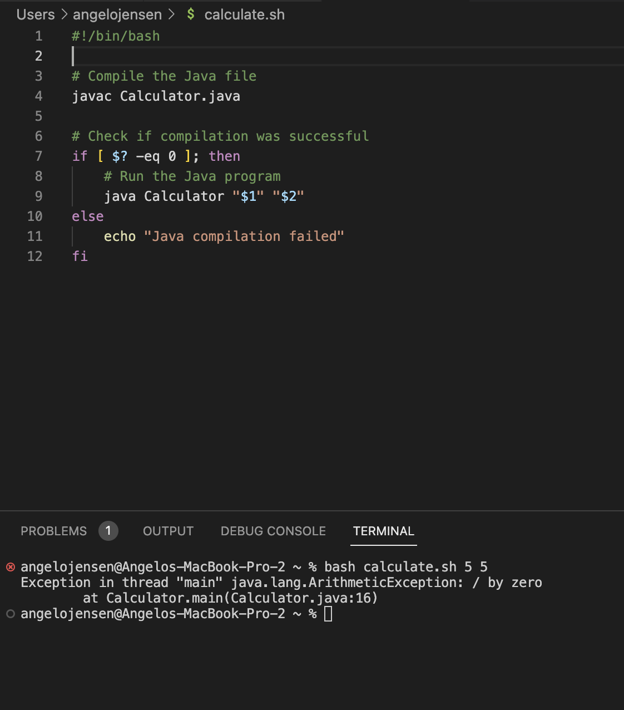

# Lab Report 5

## Part 1
**Edstem Post**





**TA Response**

The error seems to indicate that the problem is within the code itself, and not with the command ran. Have you tried searching up the division by zero operation in java?

**Bug Solution**



I was able to find the error! The bug lies in the division operation. When two numbers are equal the denominator becomes zero, which causes a division by zero error. The Arithmetic Exception thrown in the output was something I didn't know, but now I know that it was thrown due to the division by zero error.

Code Fix:

To fix the error, I included an if statement that would help catch the scenario that would result in a dvision by zero error. The if statement would run the divsion operation if subtracting num1 and num2 would not result in zero. If subtracting num1 and num2 did result in zero, the else statement would run ending the program and giving the message that "Error! Division by zero doesn't work"

**Code Before And After**

Before:





Command Line Error:

The command run before hand which caused the error was ```bash calculate.sh 5 5```

After:


With these fixes, the command ```bash calculate.sh 5 5``` will now run without an error

## Part 2
I found my lab expierence for the second half of this quarter very helpful since I didn't know a lot of things before hand. Learning about bash and git is extremely helpful as I had no idea what to do before then. During lab, seeing which commands would produce errors and which would not really helped out as well in spotting errors in the terminal, as I felt like I needed more practice for that. Overall, diving deeper and getting introduced into bash and commands helped a lot.


